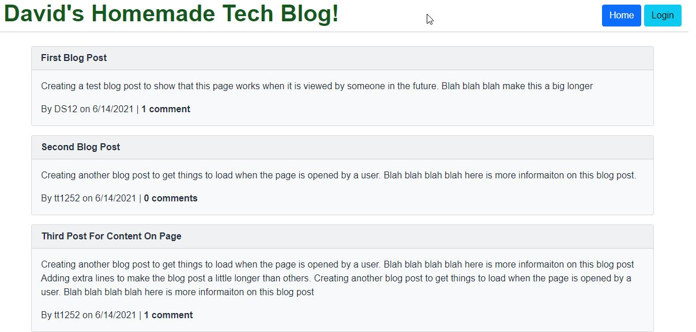
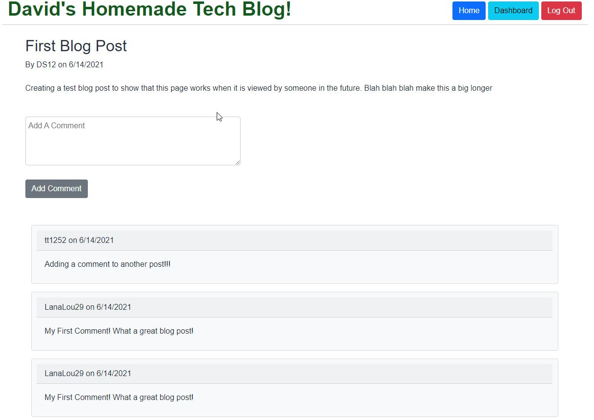
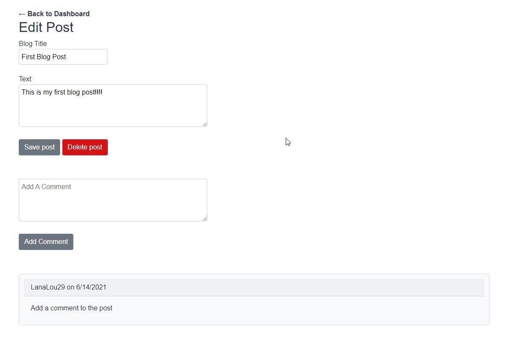
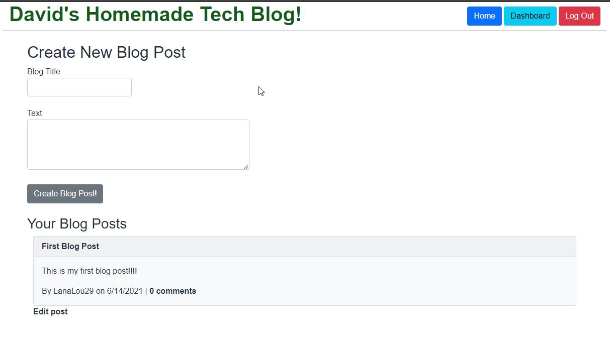

  # David's Homemade Tech Blog 

  ## About/Description

  This is a homemade tech blog.  This page allows users to log in,  create blog posts, edit previous posts, add comments to their posts and other posts, delete old posts.  This is all done using handlebars to load various pages through.  Express and Node.js handle the routes for each of the pages and the functionality.  Dotenv handles the server variables when working locally with Heroku hosting the live page.  This uses JAWSDB to create the database needed to handle the Models.

  ## Table of Contents

  * [Installation](#installation)
  * [Usage](#usage)
  * [Languages](#languages)
  * [Contributing](#contributing)
  * [License](#license)
  * [Tests](#tests)
  * [Questions](#questions)
  
  ## Installation

  npm install will install all of the required node_modules from the package.json.  Heroku hosts the page though so anyone can use the page live.

  ## Usage

  No Special Usage.  Just log in and go!

  ### Live Link of App:
  https://guarded-cliffs-83768.herokuapp.com/ 

  ### Screenshots

  #### Homepage
  
  

  #### Login/Signup Page

  

  #### Single Post pulled up of someone else's post or by a User not logged in

  

  #### Edit Post page to make changes to posts

  

  #### Dashboard for Users after they sign up or login

  

  ## Languages/Tools

  JavaScript HTML CSS ES6 jQuery Bootstrap Node Express Dotenv Jest MySQL2 Express-Handlebars Express-Session BCRYPT Connect-Session-Sequealize Sequelize

  ## Contributing

  Contributions by: David Shaw

  If you would like to contribute to this project we follow the [Contributor Covenant](https://www.contributor-covenant.org/)

  ## License

  https://choosealicense.com/licenses/mit/

  ## Tests

  Tests were written for a helper function that formats the date and plurality of comments.

  ## Questions:

  If you have any questions please contact us or refer to our github below:

  Email Us At: david.shaw1242@gmail.com

  Github Repo: https://github.com/ds1242/tech-blog

